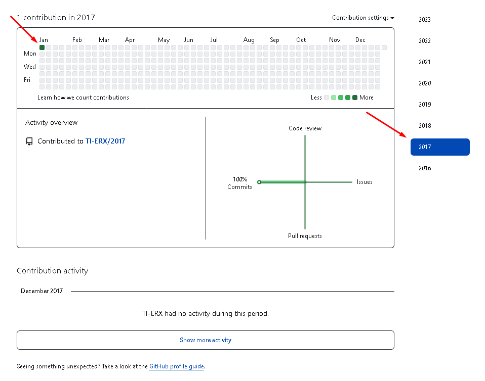
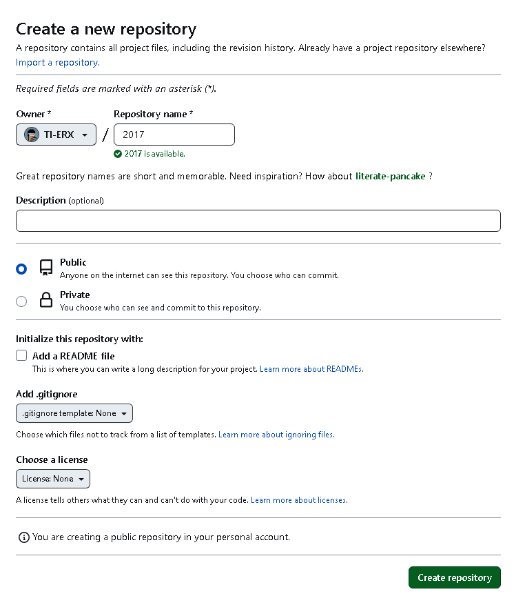
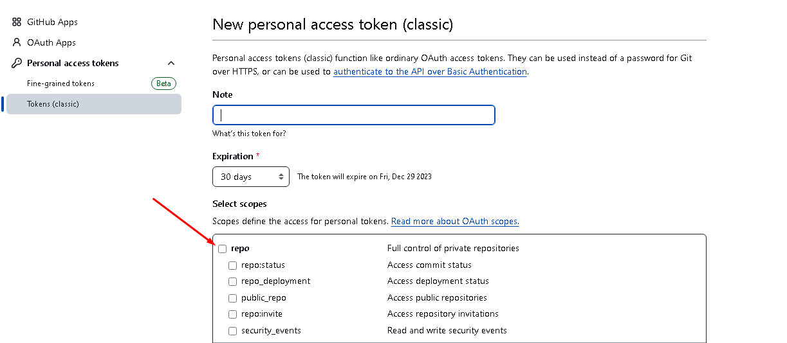
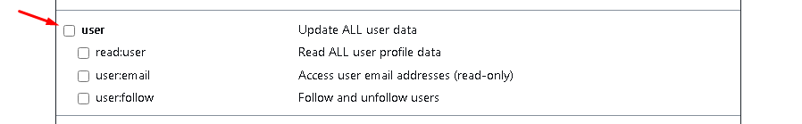

# GitHub History Back

Make your GitHub history go back as far as you want.



# First step

[Create a new repository](https://github.com/new) with the date you wish to travel back in time. Example `2017`



# Second step

[Generate a personal access token](https://github.com/settings/tokens/new) GitHub and copy it. Example below.






# Third step

If you want to generate just one commit, run the script below

```bash
sh -c "$(curl -fsSL https://raw.github.com/TI-ERX/script-only-commit/master/index.sh)"
```

Enter your GitHub username and access token and you're ready :)

<br>

### [Script V.2](https://github.com/TI-ERX/script-history-back/tree/main) Script to generate several commits at once
